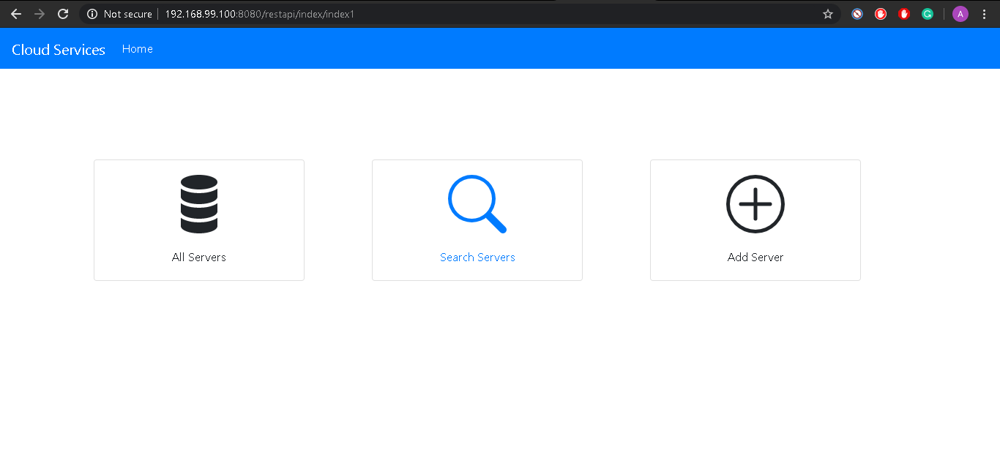
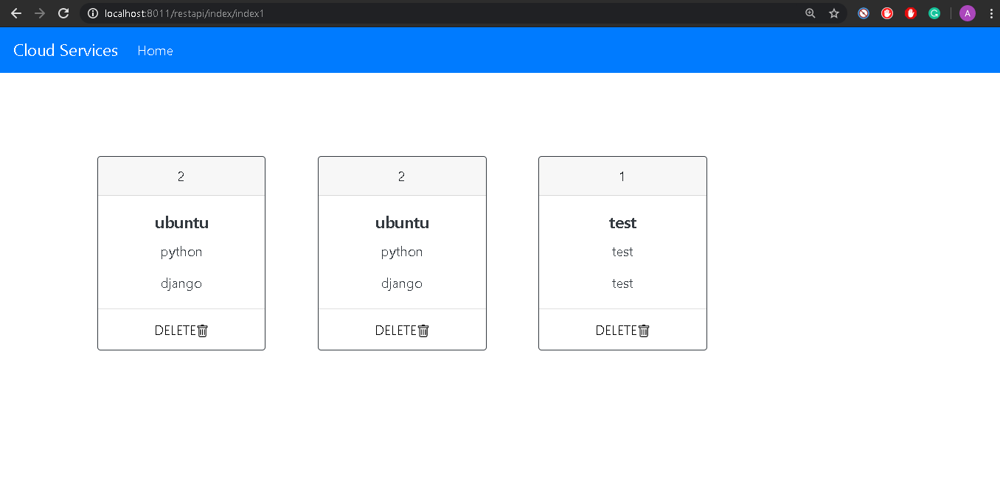
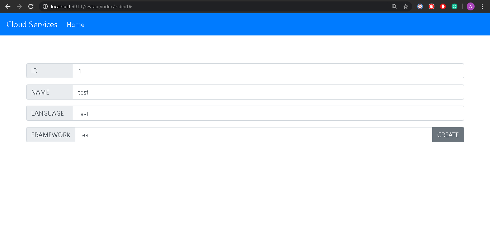
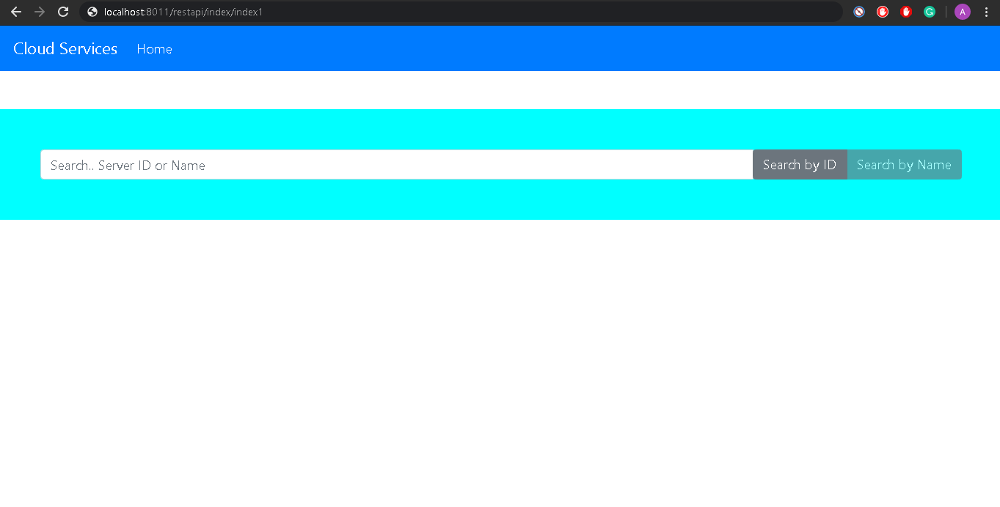

# Server-Manager-Web-UI  
### Consuming a RESTful Web Service with AJAX and Bootstrap
A basic WEB UI frontend created using **Bootstrap** framework. Used **AJAX** methods to communicate with the Rest service from the UI : 
	

### Basic Functionalities :-

1. #### Show All servers :-
	 Displays all the servers if no parameters are passed.When server id is passed as a parameter - return a single server or 404 if there’s no such a server.
 ```javascript
		        var xhttp = new XMLHttpRequest();
			//formatting data
			xhttp.open("GET", "http://localhost:8011/restapi/get_servers", true);
			xhttp.setRequestHeader("Content-type", "application/json"); 
			xhttp.send();
```

2. #### Add a Server :-
The server object is passed as a json-encoded message body. Here’s an example:<br />
 ```javascript
		      	var xhttp = new XMLHttpRequest(); 
		        var url =   document.url_input.name.value + "-";
		          url = url + document.url_input.id.value + "-";
		          url = url + document.url_input.language.value + "-"; 
		          url = url + document.url_input.framework.value  ;
		        xhttp.open("PUT", "http://localhost:8011/restapi/get_servers/"+url, true);
		        xhttp.send();
```

```BSON
		{ 
			“name”: ”my centos”,
		 	“id”: “123”,
		  	“language”:”java”,
		   	“framework”:”django” 
		}
```
3. #### Delete Server:-<br />
	 The parameter is a server ID. 
 ```javascript
		       var xhttp = new XMLHttpRequest(); 
		       xhttp.open("DELETE", "http://localhost:8011/restapi/get_servers/"+id, true);
		       xhttp.send();
```


4. #### Find Servers by Name/ ID :-<br />
	 The parameter is a string. Checks if a server name contains this string and return one or more servers found. Return 404 if nothing is found.
	 